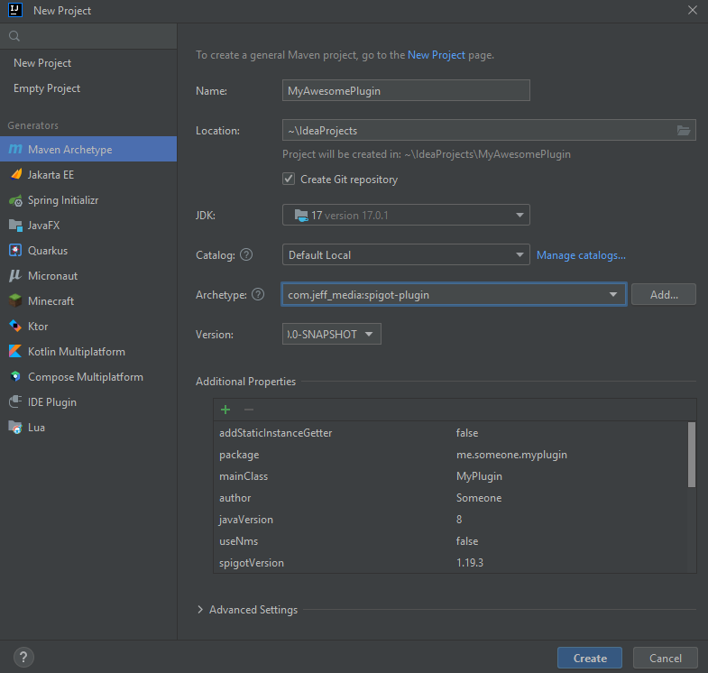

This is a maven archetype ("template project") to quickly create a new Spigot plugin from scratch. See below on how to use it.

## Features

- Automatically creates a whole project setup including main class, plugin.yml and pom.xml
- Set a custom package name, main class name, plugin name, ...
- Set a custom Spigot version to use (e.g. "1.19.3")
- Choose whether you want to use NMS or not
    - If you use NMS, it automatically adds the mojang mapping stuff to your pom.xml if using 1.17+
- Creates an "exportToServer" profile so you can deploy your .jar to your test server with one click
- Choose which dependencies you want to add, and automatically shade them when needed (JeffLib, Vault, CustomBlockData,
  MorePersistentDataTypes...)
- Optionally add a static instance getter to your main class
- ...and much more!

## Available options

#### General options

| Option               | Description                             | Default value          |
|----------------------|-----------------------------------------|------------------------|
| `groupId`            | The Maven Group ID of your plugin       |                        |
| `artifactId`         | The Maven Artifact ID of your plugin    |                        |
| `version`            | The version of your plugin              | `1.0-SNAPSHOT`         |
| `pluginName`         | The name of your plugin                 |                        |
| `description`        | Your plugin's description               |                        |
| `author`             | The author of your plugin               | `Someone`              |
| `package`            | The main package name of your plugin    | `com.example.myplugin` |
| `mainClass`          | The name of your main class             | `MyPlugin`             |
| `spigotVersion`      | The Spigot version to use               | `1.19.3`               |
| `javaVersion`        | The Java version to use, e.g. 8 or 17   | `8`                    |
| `pathToTestServer`   | The path to your server (optional)      | `C:\mctest\plugins`    |
| `addStaticGetter`    | Whether to add a static instance getter | `false`                |

#### Optional dependencies

You can also automatically add the following dependencies. Allowed values are `true` and `false`. Default is `false` for all.

| Option                        | Dependency              | Scope       | Description                                                   |
|-------------------------------|-------------------------|-------------|---------------------------------------------------------------|
| `dep.NMS`                     | Spigot                  | Provided    | Allows accessing CraftBukit and NMS classes                   |
| `dep.JeffLib`                 | JeffLib                 | Shaded      | General-purpose library                                       |
| `dep.Vault`                   | Vault                   | Soft-Depend | Permissions, Chat & Economy API                               |
| `dep.ACF`                     | ACF                     | Shaded      | Command framework                                             |
| `dep.MockBukkit`              | MockBukit               | Test        | Unit testing                                                  |
| `dep.MorePersistentDataTypes` | MorePersistentDataTypes | Shaded      | More PersistentDataTypes + Collections, Maps & Arrays for PDC |
| `dep.CustomBlockData`         | CustomBlockData         | Shaded      | PDC for Blocks                                                |
| `dep.ProtocolLib`             | ProtocolLib             | Soft-Depend | Packet sending & listening library                            |

<!--
| Allowed values                          
|-----------------------------------------
| Any valid Maven Group ID                
| Any valid Maven Artifact ID             
|                                         
| Any valid plugin name (`[a-zA-Z0-9_]+`) 
|                                         
|                                         
| Any valid Java package name             
| Any valid Java class name               
| Any valid Spigot version                
| Any valid Java version                  
| Any valid path                          
 | `true` or `false`                      
| `true` or `false`                       
| `true` or `false`                       
| `true` or `false`                       
| `true` or `false`                       
| `true` or `false`                       
    | `true` or `false`                   
| `true` or `false`                       
-->

## Usage

You simply have to clone this repo, then `mvn install` it. After that, you can use the archetype to create a new
project.

```shell
git clone https://github.com/JEFF-Media-GbR/maven-spigot-plugin
cd maven-spigot-plugin
mvn install
```

Then, you can create a new project using the archetype, either through your IDE or using the command line:

#### From within IntelliJ

1. Open IntelliJ
2. Click `File` -> `New` -> `Project...`
3. Select `Maven Archetype` on the left
4. Choose `Default Local` in the `Catalog` menu
5. Select `com.jeff-media:spigot-plugin` in the `Archetype` menu. If this does not appear, click on `Add`, then enter `com.jeff_media` as Group ID, `spigot-plugin` as Artifact ID and `1.0.0-SNAPSHOT` as Version.
6. Fill in the properties to your likings




#### From Command line

```shell
mvn archetype:generate -DarchetypeArtifactId=spigot-plugin -DarchetypeGroupId=com.jeff_media -DarchetypeVersion=1.0.0-SNAPSHOT -D<option>=<value> ...
```

## Todo
- Add SpigotUpdateChecker dependency
- Add WorldEdit / WorldGuard dependency