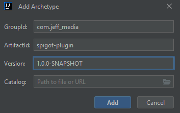

This is a maven archetype ("template project") to quickly create a new Spigot plugin from scratch. See below on how to use it.

## Features

- Automatically creates a whole project setup including main class, plugin.yml and pom.xml
- Set a custom package name, main class name, plugin name, ...
- Set a custom Spigot version to use (e.g. "1.19.3")
- Choose whether you want to use NMS or not
    - If you use NMS, it automatically adds the mojang mapping stuff to your pom.xml if using 1.17+
- Creates an "exportToServer" profile so you can deploy your .jar to your test server with one click
- Choose which dependencies you want to add, and automatically shade them when needed (JeffLib, Vault, CustomBlockData,
  MorePersistentDataTypes...)
- Optionally add a static instance getter to your main class
- ...and much more!

## Available options

| Option                   | Description                                                                                                           | Allowed values                          | Default value          |
|--------------------------|-----------------------------------------------------------------------------------------------------------------------|-----------------------------------------|------------------------|
| `groupId`                | The Maven Group ID of your plugin                                                                                     | Any valid Maven Group ID                |                        |
| `artifactId`             | The Maven Artifact ID of your plugin                                                                                  | Any valid Maven Artifact ID             |                        |
| `version`                | The version of your plugin                                                                                            |                                         | `1.0-SNAPSHOT`         |
| `pluginName`             | The name of your plugin                                                                                               | Any valid plugin name (`[a-zA-Z0-9_]+`) |                        |
| `description`            | Your plugin's description                                                                                             |                                         |                        |
| `author`                 | The author of your plugin                                                                                             |                                         | `Someone`              |
| `package`                | The main package name of your plugin                                                                                  | Any valid Java package name             | `com.example.myplugin` |
| `mainClass`              | The name of your main class (without package name)                                                                    | Any valid Java class name               | `MyPlugin`             |
| `spigotVersion`          | The Spigot version to use                                                                                             | Any valid Spigot version                | `1.19.3`                 |
| `javaVersion`            | The Java version to use (language level), e.g. 8 or 17                                                                | Any valid Java version                  | `8`                      |
| `pathToTestServer`       | The path to your test server. When the `exportToServer` profile is enabled, your .jar will be exported there.         | Any valid path                          | `C:\mctest\plugins`    |
| `useStaticInstanceGetter` | Whether to add a static instance getter to your main class                                                            | `true` or `false`                       | `false`                |
| `useNMS`                 | Whether to include NMS dependency (`spigot` instead of `spigot-api`)                                                  | `true` or `false`                       | `false`                |
| `useJeffLib`             | Whether to include JeffLib as shaded dependency                                                                       | `true` or `false`                       | `false`                |
| `useVault`               | Whether to include Vault as provided dependency and as softdepend                                                     | `true` or `false`                       | `false`           |
| `useACF`                 | Whether to include ACF as shaded dependency                                                                           | `true` or `false`                       | `false`                |
| `useMockBukkit`          | Whether to include MockBukkit and JUnit as test dependency                                                            | `true` or `false`                       | `false`                |
| `useMorePersistentDataTypes` | Whether to include MorePersistentDataTypes as shaded dependency                                                       | `true` or `false`                       | `false`                |
| `useCustomBlockData`     | Whether to include CustomBlockData as shaded dependency                                                               | `true` or `false`                       | `false`                |


## Usage

You simply have to clone this repo, then `mvn install` it. After that, you can use the archetype to create a new
project.

```shell
git clone https://github.com/JEFF-Media-GbR/maven-spigot-plugin
cd maven-spigot-plugin
mvn install
```

Then, you can create a new project using the archetype, either through your IDE or using the command line:

#### From within IntelliJ

1. Open IntelliJ
2. Click `File` -> `New` -> `Project...`
3. Select `Maven Archetype` on the left
4. Choose `Default Local` in the `Catalog` menu
5. Select `com.jeff-media:spigot-plugin` in the `Archetype` menu. If this does not appear, click on `Add`, then enter `com.jeff_media` as Group ID, `spigot-plugin` as Artifact ID and `1.0.0-SNAPSHOT` as Version.
6. Fill in the properties to your likings




#### From Command line

```shell
mvn archetype:generate -DarchetypeArtifactId=spigot-plugin -DarchetypeGroupId=com.jeff_media -DarchetypeVersion=1.0.0-SNAPSHOT -D<option>=<value> ...
```